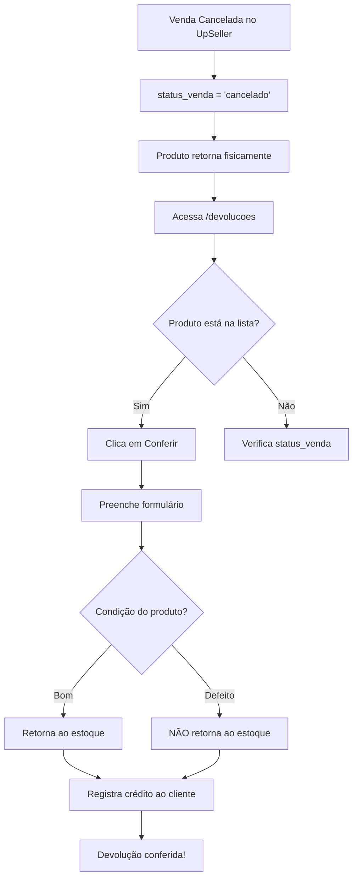

# Sistema de Conferência de Devoluções

## 📦 Visão Geral

Sistema completo para gerenciar devoluções físicas de produtos de vendas canceladas. Permite conferir itens retornados, verificar condição (bom/defeituoso), atualizar estoque automaticamente e registrar reversões financeiras.

## 🎯 Objetivo

Resolver o problema de vendas que são canceladas no UpSeller mas cujos produtos retornam fisicamente ao estoque. O sistema permite:

1. **Rastrear devoluções pendentes**: Vendas canceladas aguardando retorno físico
2. **Conferir produtos**: Registrar quantidade e condição dos itens recebidos
3. **Atualizar estoque**: Produtos em bom estado retornam automaticamente ao estoque
4. **Reversão financeira**: Crédito automático para o cliente

## 🗄️ Estrutura do Banco de Dados

### Tabela `obsidian.devolucoes`

```sql
CREATE TABLE obsidian.devolucoes (
    id SERIAL PRIMARY KEY,
    venda_id BIGINT NOT NULL,
    sku_produto VARCHAR(100) NOT NULL,
    quantidade_esperada INTEGER NOT NULL,
    quantidade_recebida INTEGER DEFAULT 0,
    condicao VARCHAR(20) DEFAULT 'pendente',
    conferido_em TIMESTAMP,
    conferido_por VARCHAR(100),
    observacoes TEXT,
    created_at TIMESTAMP DEFAULT CURRENT_TIMESTAMP,
    updated_at TIMESTAMP DEFAULT CURRENT_TIMESTAMP,
    CONSTRAINT fk_venda FOREIGN KEY (venda_id) REFERENCES obsidian.vendas(venda_id)
);
```

**Campos principais:**
- `venda_id`: Referência à venda cancelada
- `quantidade_esperada`: Quantidade que deveria retornar (da venda)
- `quantidade_recebida`: Quantidade efetivamente recebida (pode ser parcial)
- `condicao`: `'bom'` (volta ao estoque), `'defeito'` (não volta), `'pendente'` (não conferido)
- `conferido_em`: Data/hora da conferência física
- `conferido_por`: Usuário que realizou a conferência

## 🔌 API Endpoints

### GET `/api/devolucoes/pendentes`

Lista vendas canceladas pendentes de conferência física.

**Filtros aplicados:**
- `status_venda = 'cancelado'`
- `fulfillment_ext = false` (exclui vendas de fulfillment)
- Sem registro de devolução OU devolução não conferida

**Resposta:**
```json
{
  "total": 15,
  "devoluções": [
    {
      "venda_id": 12345,
      "pedido_uid": "PED-2025-001",
      "nome_cliente": "João Silva",
      "sku_produto": "PROD-001",
      "nome_produto": "Produto Exemplo",
      "quantidade_vendida": 2,
      "canal": "SHOPEE",
      "valor_total": 150.00,
      "devolucao_id": null,
      "condicao": null
    }
  ]
}
```

### POST `/api/devolucoes/conferir`

Registra conferência de devolução física.

**Body:**
```json
{
  "venda_id": 12345,
  "sku_produto": "PROD-001",
  "quantidade_esperada": 2,
  "quantidade_recebida": 2,
  "condicao": "bom",
  "conferido_por": "usuario@email.com",
  "observacoes": "Produto em perfeito estado"
}
```

**Validações:**
- `condicao` deve ser `"bom"` ou `"defeito"`
- `quantidade_recebida` deve ser ≥ 0 e ≤ `quantidade_esperada`
- Permite devoluções parciais

**Comportamento:**
1. **Se condição = "bom"**: 
   - Adiciona quantidade ao estoque (`INSERT` em `estoque_movimentos`)
   - Tipo movimento: `'entrada'`
   - Observação: `"Devolução de venda cancelada (ID: {venda_id})"`

2. **Se condição = "defeito"**:
   - NÃO adiciona ao estoque
   - Apenas registra a devolução

3. **Reversão financeira**:
   - Calcula valor proporcional: `(valor_total / quantidade_esperada) * quantidade_recebida`
   - Cria pagamento tipo `'credito'` para o cliente
   - Status: `'confirmado'`
   - Método: `'devolucao'`

**Resposta:**
```json
{
  "success": true,
  "message": "Devolução conferida com sucesso",
  "devolucao_id": 123,
  "estoque_atualizado": true,
  "quantidade_retornada_estoque": 2
}
```

### GET `/api/devolucoes/historico`

Lista histórico de devoluções já conferidas.

**Query params:**
- `limit` (default: 100)
- `offset` (default: 0)

**Resposta:**
```json
{
  "total": 50,
  "histórico": [
    {
      "id": 123,
      "venda_id": 12345,
      "sku_produto": "PROD-001",
      "quantidade_esperada": 2,
      "quantidade_recebida": 2,
      "condicao": "bom",
      "conferido_em": "2025-11-06T10:30:00",
      "conferido_por": "usuario@email.com",
      "observacoes": "Produto em perfeito estado",
      "nome_cliente": "João Silva",
      "nome_produto": "Produto Exemplo"
    }
  ]
}
```

### GET `/api/devolucoes/:id`

Busca detalhes de uma devolução específica.

### DELETE `/api/devolucoes/:id`

Cancela registro de devolução (somente se não foi conferida ainda).

## 🖥️ Interface Frontend

### Página `/devolucoes`

**Componente:** `src/pages/Devolucoes.tsx`

#### Recursos:

1. **Cards de Resumo**
   - Pedidos Pendentes
   - Itens Aguardando
   - Valor Total

2. **Lista Agrupada por Pedido**
   - Vendas agrupadas por `pedido_uid`
   - Expansível/colapsável
   - Mostra: cliente, canal, valor, quantidade de itens

3. **Dialog de Conferência**
   - Informações da venda
   - Input: quantidade recebida
   - Radio: condição (bom/defeito)
   - Textarea: observações
   - Validação em tempo real

#### Fluxo de Uso:

1. Usuário acessa `/devolucoes`
2. Sistema lista vendas canceladas pendentes
3. Usuário clica em "Conferir" no item
4. Preenche quantidade recebida e condição
5. Confirma conferência
6. Sistema atualiza estoque (se bom) e registra crédito

## 🔄 Fluxo Completo do Processo



## 📝 Regras de Negócio

1. **Vendas de Fulfillment são EXCLUÍDAS** (`fulfillment_ext = false`)
   - Conforme regras do sistema, fulfillment não afeta estoque

2. **Devoluções Parciais são Permitidas**
   - `quantidade_recebida` pode ser menor que `quantidade_esperada`
   - Valor de crédito é proporcional

3. **Produtos Defeituosos não Retornam ao Estoque**
   - Apenas registra a devolução
   - Cliente ainda recebe crédito

4. **Crédito Automático**
   - Sempre que devolução é confirmada
   - Valor proporcional à quantidade recebida
   - Tipo: `'credito'`, Status: `'confirmado'`, Método: `'devolucao'`

5. **Transações Atômicas**
   - Toda conferência usa `BEGIN...COMMIT`
   - Se falhar, faz `ROLLBACK` completo

## 🚀 Como Usar

### Para o Usuário Final:

1. **Marcar vendas como canceladas:**
   - No UpSeller, exportar planilha com `status = "cancelado"`
   - Importar no sistema (as vendas ficam com `status_venda = 'cancelado'`)

2. **Conferir devoluções:**
   - Acessar menu lateral → "Devoluções"
   - Ver lista de produtos aguardando retorno
   - Clicar em "Conferir" quando produto chegar
   - Informar quantidade recebida e condição
   - Confirmar

3. **Acompanhar histórico:**
   - Seção "Histórico" (futura implementação na página)

### Para Desenvolvedores:

**Executar migration:**
```bash
cd backend
node run-migration.js
```

**Testar sistema:**
```bash
node test-devolucoes.js
```

**Criar venda cancelada para teste:**
```sql
UPDATE obsidian.vendas
SET status_venda = 'cancelado'
WHERE venda_id = 12345;
```

## 📊 Integração com Outras Partes do Sistema

### Tabelas Afetadas:

1. **obsidian.vendas**
   - Lê vendas com `status_venda = 'cancelado'`
   - Filtra por `fulfillment_ext = false`

2. **obsidian.estoque_movimentos**
   - Insere movimentação tipo `'entrada'` quando condição = bom
   - Observação inclui ID da venda

3. **obsidian.pagamentos**
   - Insere crédito para o cliente
   - Tipo `'credito'`, método `'devolucao'`

4. **obsidian.clientes**
   - Busca `client_id` da venda para associar crédito

## 🔐 Segurança

- Todas as rotas devem ser protegidas por autenticação
- Validação de dados no backend
- Transações atômicas previnem inconsistências
- Foreign keys garantem integridade referencial

## 📦 Arquivos Criados

### Backend:
- `backend/migrations/001_create_devolucoes_table.sql` - Migration da tabela
- `backend/src/routes/devolucoes.ts` - Rotas da API
- `backend/run-migration.js` - Script para executar migration
- `backend/test-devolucoes.js` - Script de teste

### Frontend:
- `src/pages/Devolucoes.tsx` - Página de conferência
- Alteração em `src/App.tsx` - Nova rota
- Alteração em `src/components/app-sidebar.tsx` - Menu lateral

## 🎨 UI/UX

- **Design consistente** com o resto do sistema
- **Cards expansíveis** para melhor organização
- **Validação em tempo real** no formulário
- **Feedback visual** claro (success/error)
- **Responsivo** para desktop e mobile

## 🐛 Troubleshooting

**Problema: Vendas canceladas não aparecem na lista**
- ✅ Verificar se `status_venda = 'cancelado'` (case-insensitive)
- ✅ Verificar se `fulfillment_ext = false`
- ✅ Rodar query manual para confirmar

**Problema: Estoque não atualiza**
- ✅ Verificar se condição foi marcada como `'bom'`
- ✅ Verificar logs do backend
- ✅ Checar tabela `estoque_movimentos`

**Problema: Crédito não aparece para cliente**
- ✅ Verificar se `client_id` está preenchido na venda
- ✅ Checar tabela `pagamentos` com tipo `'credito'`
- ✅ Verificar cálculo proporcional

## 📈 Melhorias Futuras

- [ ] Aba de "Histórico" na página de devoluções
- [ ] Filtros por período, canal, cliente
- [ ] Export para Excel do histórico
- [ ] Notificações quando novos itens chegam
- [ ] Dashboard com métricas de devoluções
- [ ] Upload de fotos do produto devolvido
- [ ] Integração com sistema de logística reversa

## ✅ Status: Completo e Funcional

Sistema totalmente implementado e pronto para uso em produção! 🚀
